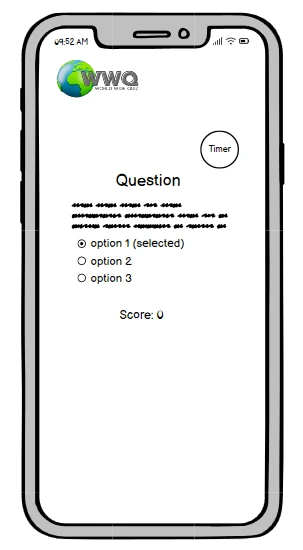
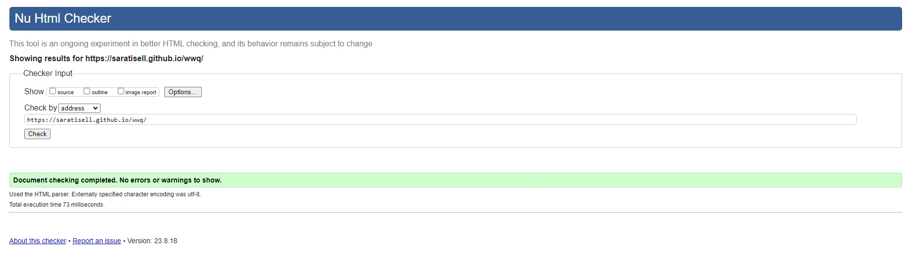
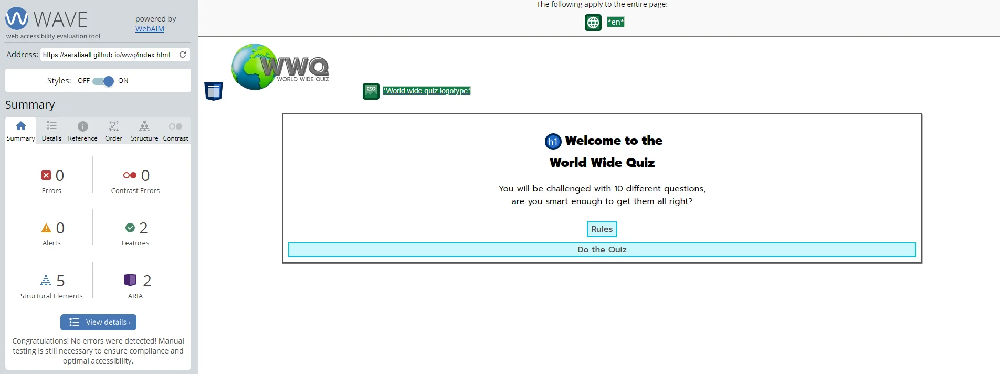
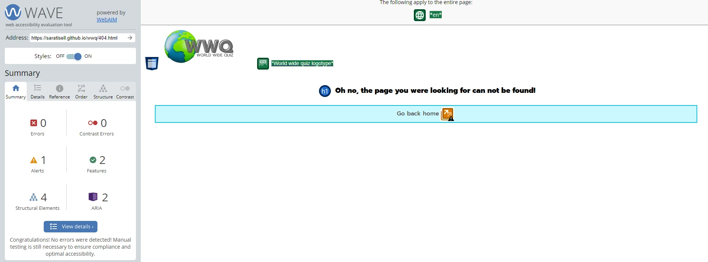

# WWQ - World Wide Quiz

World Wide Quiz or WWQ for short is a webapplication build with Javascript where the user will try their knowlegdge by answering 10 different questions of mixed genre.

[WWQ live link](https://saratisell.github.io/wwq/)

## Features

### Site wide

#### Navigation

* Header
  * WWQ logo will contain a link to home page so the user easily can navigate back home from all pages.

* Body Home page
  * The user will be able to open up a modal that will show the rules for the quiz.
  * A link to the quiz page will be placed under the rules button.

* Body Quiz page
  * When the user has completed the quiz links will be shown to give the user the opportunity to play again or go back to the home page.

* Footer 
  * The footer will contain social media links that will open in a new tab when clicked by the user.
  * By open the link in a new tab will hinder the user to leave the WWQ site when exploring social media.

* Favicon
  * A favicon with an image of the erath from the logo will be added so the user will recognise the site in the tab of the browser.

 

* 404 page
  * A custom designed 404 page to match the rest of the site will be implemeted.
  * A link back to the home page will be displayed on the 404 page so the user easily can navigate back to home page.

  

##### Home Page

*Content* 
* Welcome text and short description about the site.
* Button for opening the rules in an modal.
  * The user will be challenged with 10 different questions, where each question has three options and one correct answer.
  * The user has 10 seconds to answer each question before it self moving to the next question and no score will be collected.
  * If the user select the correct answer the score will be increased with 1 point.
  * If the user select the wrong answer the score will be decreased with 1 point.
  * The total score will be displayed after the quiz is completed.
* Link to go to the quiz page and start the quiz directly.
  

##### Quiz Page

*Content*
* Timer
  * Will start direct when a question is displayed and count down from 10.
  * Will make the quiz to move on to the next question when counted down to 0.
  * If the quiz is completed the results will be displayed.
* Question heding
  * Will show the user which question they are at.
* Question
  * The questions will be of mixed genre and displayed for the user.
* Options
  * Each question will have three options the user can choose from. Only ONE is correct.
  * When one option is collected, the user will be moved to the next question.
  * If the user have answered all 10 questions and the quiz is completed the results will be displayed.

###### Results

*Content*
* After the quiz is completed the results will be displayed for the user.
* The users total score will be displayed.
* The user can either play the quiz again by clicking the link that will load the quiz page and the quiz will start over.
* Or click the link back to the home page.

### Features left to implement

* Function to save and display highscore from all users.
* Possibility for the user to create a username and save their quiz history and score.
* Add function to display which question the user answered corrct/wrong on the result section.
* Implement more questions.

## Design

### Wireframe
*As the site were build it come clear that the design could be improved to make it more user friendly.*

-Home page 

-Quiz page

### Colorscheme

### Typography

Sans-serif font is used due to its advantage for accessibility and imported from Google fonts
* Prompt - For headings and content

### Responsiveness

* The WWQ site will be fully responsive and can be used on different devices and screen sizes.

## Technologies Used

* HTML
  * The main language to develope the structure of the website.
* CSS
  * Styling for the website was written with cusom CSS in seperate file style.css.
* Javascript
  * The functions were written with javascript. Functions for gquiz page were written in a seperate file. Functions for modal on home page were implemented by script tag at the bottom of the body in index.html.
* Codeanywhere
  * IDE used to develope website.
* Gitpod
  * IDE Used to develope website.
* Git
  * Used to push and commit code.
* GitHub
  * To source code and deploy using Git pages.
* [Balsamiq](https://balsamiq.com/wireframes/desktop/#)
  * Used to design wireframes.
* [Canva](https://www.canva.com/)
  * Used to design logo, favicon and make colorscheme.
* [Favicon.io](https://favicon.io/)
  * Used to create favicon file
* [Pixelied.com](https://pixelied.com/convert/png-converter/png-to-webp)
  * Used to convert png images to webp.
* [Font Awesome](https://fontawesome.com/)
  * Used to implement icons.
* [Google Fonts](https://fonts.google.com/)
  * Used to import fonts

### Languages
* HTML
  * To develope website structure.
* CSS
  * To give the site cusom styling.
* Javascript
  * To develope functions to the site.

## Testing

### Browsers

WWQ website were tested on these browsers: 

* Chrome
* Firefox
* Microsoft Edge

WWQ website were tested on these additional devices through DevTool
* Chrome
  * iPhone pro 12
  * Galaxy Tab S4
* Firefox 
  * Galaxy s20 Android 11
  * iPad iPadOS 14.7.1
* Microsoft Edge
  * Noki N9
  * iPad pro

No issues was found.

* Responsive through all pages.
* The design is consistent and correct thorug all pages.
* Navigation is correct and no broken links.
* Rules button
  * Works correct, open up modal when clicked and hides when clicked on the x icon or outside the modal.
* Option buttons
  * Works correct and takes the user to next the question or displays results if quiz is completed.

### Bugs

No know bugs were found during the testing.

### Lighthouse Testing

### [W3C HTML Validator](https://validator.w3.org/)

Website HTML were tested through both uri and text input and showed no error.

### [W3C CSS Validator (Jigsaw)](https://jigsaw.w3.org/css-validator/#validate_by_input)

Website CSS were tested through both uri and text input and showed no error, but one warning.

### [JShint Validator](https://jshint.com/)

Jshint showed no error.

### [WAVE](https://wave.webaim.org/)

Wave accessibility tool showed no error.

## Deployment
The site was deployed to GitHub pges thorugh these steps:
* In the GitHub repository, navigate to the Settings tab.
* From the menu on left select 'Pages'
* From the source section drop-down menu, select the Main Branch
* Click 'Save'
* A live link to the webpage will be found under environments

The live link is found here: https://saratisell.github.io/wwq/

## Credits

### Code
* https://www.shecodes.io/athena/52336-how-to-create-a-countdown-timer-in-javascript 
  * Code for the timer function was borrowed from this site.
* https://www.codewithfaraz.com/content/161/build-a-quiz-application-with-html-css-and-javascript-step-by-step-guide
  * Code for question array syntax was borrowed from this site.
* https://byby.dev/js-add-event-listener
  * Code for how to add a eventlisteners to options buttons were borrowed from this site.
* https://www.codingnepalweb.com/quiz-app-with-timer-javascript/
  * Code to show the result after the quiz is complete was borrowed from this site.
* Function to increse user score borrowed from Love Maths Walkthrough Project.
* HTML for social media links and favicon implementing was borrowed from the Love Running Project.

### Content
* https://www.ef.com/wwen/blog/language/questions-virtual-pub-quiz/
  * Questions and answers for the quiz was borrowed from this site.

### Support
* My mentor Gareth McGirr for vise advice and support through my project.

